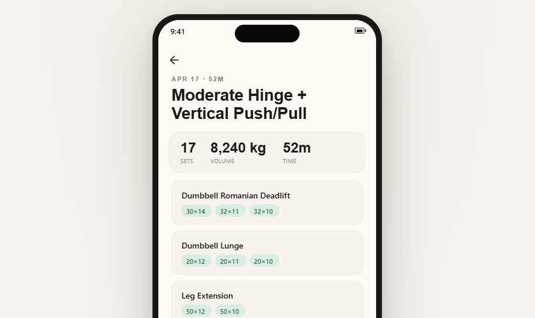

# Exercise Logger

A local-first progressive web app for tracking gym workouts. Runs entirely in the browser with offline support — no server, no account, no data leaves your device.

**[Live Demo](https://alvarocreixell.github.io/exercise-logger/)** · MIT licensed

## Screenshots

<p align="center">
  
  
  
</p>

## What it does

- **Routine management** — Import YAML-based workout routines with structured set blocks, rep ranges, supersets, and cardio options.
- **Workout logging** — Tap-to-log sets with weight/reps pre-filled from history and progression suggestions.
- **Automatic progression** — Per-block +5% weight suggestions when all sets hit the top of the rep range.
- **Full history** — Browse past sessions, drill into per-exercise history grouped by block.
- **Offline-first** — Service worker caches all assets; IndexedDB stores all data locally.
- **Installable** — Add to home screen on any device for a native app experience.

## How this was built

Every line of code in this repository was written by AI coding agents — [Claude Code](https://claude.ai/claude-code) and [Codex](https://openai.com/index/codex/) — with human direction, review, and iteration at every step.

This wasn't "generate code and hope for the best." The development followed a structured, multi-pass workflow:

1. **Spec-first design.** Product requirements written as a detailed design document, reviewed and iterated on before any code was generated. All 12 design iterations and per-feature specs are preserved under [`docs/archive/specs/`](docs/archive/specs/).
2. **Phased planning.** A 7-phase master plan broken into 48 granular implementation plans, each reviewed for correctness and cross-checked by a second model (Codex audited Claude's plans and vice versa). All plans preserved under [`docs/archive/plans/`](docs/archive/plans/).
3. **Deterministic harnesses.** Every planned behavior required a passing test. 742 unit/integration tests + a Playwright E2E suite, all enforced in CI alongside lint, type-check, and build.
4. **Skill-driven execution.** Development used [Superpowers](https://github.com/anthropics/claude-code-plugins) plugin skills for structured brainstorming, plan writing, test-driven development, code review, verification gates, and branch completion workflows.
5. **Adversarial review.** Codex reviewed Claude's implementations for bugs, contract violations, and architectural drift; Claude reviewed Codex's findings for false positives. Review artifacts preserved under [`docs/archive/reviews/`](docs/archive/reviews/).
6. **Human-in-the-loop.** I wrote the original spec, directed the architecture, reviewed every plan, made product decisions, tested on my phone, and iterated based on real usage.

The result is a codebase that reads like a disciplined team produced it — because the process enforced the same rigor a good team would.

Start with [`docs/archive/README.md`](docs/archive/README.md) for a curated 5-minute tour of the artifacts.

## Codebase stats

### Code

| Metric               | Value                                       |
|----------------------|---------------------------------------------|
| Total commits        | 340+                                        |
| Active dev days      | 18 across a 55-day calendar span            |
| Source code          | 10,587 lines across 120 files               |
| Test code            | 15,034 lines across 69 files                |
| Test-to-source ratio | **1.42×** — more test code than application code |
| Test suite           | 742 unit/integration + Playwright E2E       |
| Domain invariants    | 12 formally enforced in services            |

### Planning and review artifacts

| Artifact                     | Count |
|------------------------------|-------|
| Design specs                 | 12    |
| Implementation plans         | 48    |
| Hardening passes             | 3 (broken-and-dangerous, spec-fidelity, schema-and-quality) |
| Cross-model audits           | 3 (Claude audit, Codex audit, consolidated report) |
| Errata items applied         | 48    |
| Codebase reviews             | 3     |
| UI design handoffs           | 2     |

### Commits by type

| Type        | Count |
|-------------|-------|
| `feat:`     | 158   |
| `fix:`      | 87    |
| `docs:`     | 33    |
| `chore:`    | 15    |
| `test:`     | 13    |
| `refactor:` | 12    |
| `spec:`     | 5     |
| other       | ~17   |

### Notable

- **Test-to-source ratio > 1** is uncommon even in professional codebases — every behavior is backed by a deterministic test.
- **The project was rewritten twice** before landing on the final architecture (spec dates: Mar 23, Mar 26, Mar 28).
- The full development record — plans, specs, reviews, handoffs — is preserved under [`docs/archive/`](docs/archive/).

## Tech stack

| Layer      | Choice                                            |
|------------|---------------------------------------------------|
| Framework  | React 19 + TypeScript 5                           |
| Build      | Vite 7                                            |
| UI         | shadcn/ui + Tailwind CSS 4                        |
| Storage    | Dexie.js 4 (IndexedDB)                            |
| PWA        | vite-plugin-pwa (Workbox)                         |
| Testing    | Vitest + React Testing Library + Playwright       |
| CI/CD      | GitHub Actions → GitHub Pages                     |

## Architecture

```
Features (Screens + Components) → Hooks → Services → Dexie (IndexedDB)
```

Each layer only calls the layer below. Services are pure functions taking `db` as the first argument. UI state reads from Dexie reactively via `useLiveQuery`. Sessions snapshot all routine/exercise data at creation so history survives routine changes.

```
web/src/
  app/          # Entry point, routing, global styles
  domain/       # Types, enums, pure helpers (no React, no DB)
  db/           # Dexie database class, schema, initialization
  services/     # Business logic (session, set, progression, backup)
  shared/       # Cross-feature hooks, UI primitives, utilities
  features/     # Feature modules
    today/      #   Routine overview, day selection, start workout
    workout/    #   Active workout logging, exercise cards, set forms
    history/    #   Session history, session detail, exercise history
    settings/   #   Settings, routine import, backup/restore
  data/         # Embedded exercise catalog (CSV)
```

Full conventions, invariants, and gotchas are documented in [`CLAUDE.md`](CLAUDE.md) with layer-specific guides under `web/src/*/CLAUDE.md`.

## Getting started

```bash
cd web
npm install
npm run dev         # Dev server at localhost:5173
```

### Other commands

```bash
npm test            # Unit + integration tests (Vitest)
npm run build       # Production build with PWA
npm run preview     # Preview production build at localhost:4173
npm run test:e2e    # Build + Playwright E2E tests
npm run lint        # ESLint
```

## Documentation

- [`CLAUDE.md`](CLAUDE.md) — Project guide: conventions, invariants, gotchas.
- [`docs/design-spec.md`](docs/design-spec.md) — Product specification.
- [`docs/archive/README.md`](docs/archive/README.md) — Curated tour of the development history (plans, specs, reviews, handoffs).
- [`docs/custom-gpt/`](docs/custom-gpt/) — Custom ChatGPT routine-maker docs.

## License

[MIT](LICENSE)
