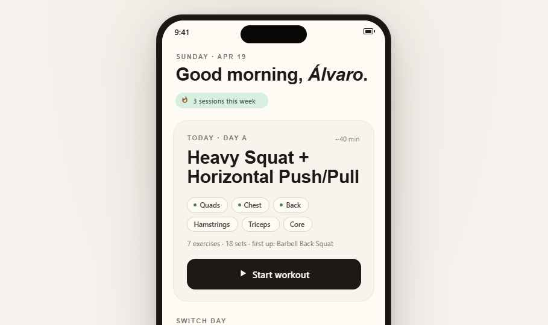
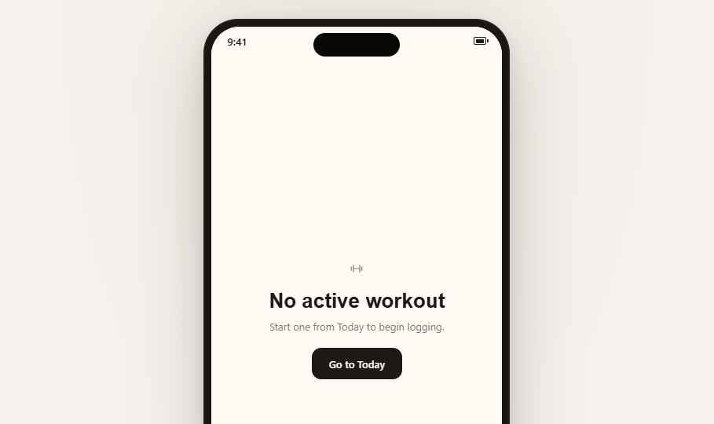
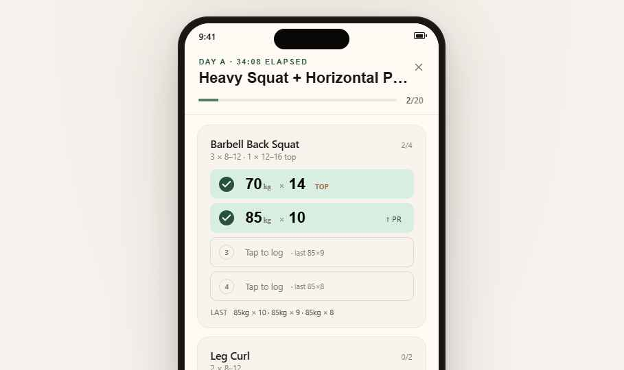
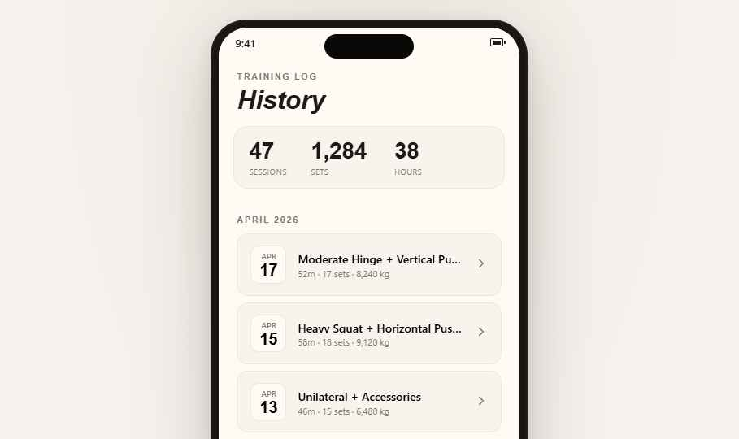
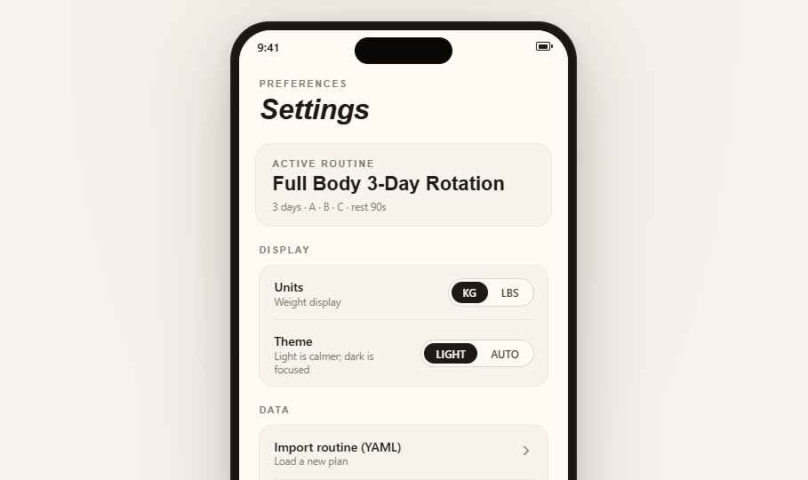

# Exercise Logger — Design Handoff

A local-first workout logger. Phone-first, one-handed, fast.
The whole prototype lives in `Exercise Logger.html`; screenshots below.

> This doc is the design-side companion to `handoff/README.md` (which covers
> the two code changes to the live codebase: theme removal + workout-complete
> state). Read that one for what ships to users next; read this one for the
> visual + interaction system the design converges on.

---

## At a glance

| | |
|---|---|
| Platform | Installable PWA, phone-first (390×812 target) |
| Frame | iPhone 15-style status bar + dynamic island, no home indicator in shell |
| Primary typeface | Inter (400/500/600/700) — UI, numerals, labels |
| Display typeface | Instrument Serif — screen titles + hero headings only |
| Color model | `oklch()` throughout; the palette is warm paper + sage |
| Motion | 200–300ms `ease`; tactile, never showy |
| Dark mode | **Out of scope.** See `handoff/docs/design-spec.md` drift block |



---

## 1. Design tokens

All tokens live in `:root` on `Exercise Logger.html` (lines 11–24). Copy
verbatim if porting to Tailwind / CSS modules.

### Color

```css
/* Surface */
--paper:      oklch(98.8% 0.008 80);   /* app background, phone-inner */
--card:       oklch(96.8% 0.01  80);   /* elevated blocks, sheet */

/* Ink */
--ink:        oklch(22%   0.012 55);   /* primary text, CTAs */
--ink-2:      oklch(38%   0.012 55);   /* secondary text */
--ink-3:      oklch(58%   0.01  60);   /* tertiary / placeholders / meta */

/* Hairlines */
--line:       oklch(88%   0.012 75);   /* card borders */
--line-soft:  oklch(93%   0.01  75);   /* dividers inside cards */

/* Accent — Sage (default) */
--sage:       oklch(55%   0.055 160);  /* logged state, success */
--sage-deep:  oklch(40%   0.06  160);  /* sage on sage-soft */
--sage-soft:  oklch(93%   0.03  160);  /* logged-set fill, streak pill */

/* Semantic */
--warm:       oklch(55%   0.09  55);   /* PR / flame / warning */
--danger:     oklch(55%   0.15  25);   /* discard, destructive */
```

Page background (outside the phone) is `oklch(96% 0.008 70)` with a soft warm
radial at the top — this is the "table" the device sits on, not in-app.

### Type

```
Inter            400 / 500 / 600 / 700    — all UI chrome
Instrument Serif 400 italic + 400 regular — hero titles only
```

- Never mix serif numerals with sans labels inside the same row. Numerals
  default to **Inter tabular-nums** (`font-feature-settings: 'tnum'`) for
  column alignment on set rows and stat tiles.
- The **Numeral style** Tweak (serif/sans) swaps the serif hero numerals to
  Inter 600 via a `.phone-inner [style*="Instrument Serif"]` override. Hero
  numerals should stay serif on the finished build (see §5).

Scale used in the prototype:

| Role | Size / weight | Notes |
|---|---|---|
| Screen title (serif) | 32px / Instrument Serif 400 | Today + History + Settings + SessionDetail |
| Card title | 20–22px / Inter 600 | Routine card, exercise name |
| Set row number | 22px / Inter 700 tabular-nums | Both logged + empty rows |
| Eyebrow | 11px / Inter 600 / uppercase / 0.08em tracking | "SUNDAY · APR 19", "DISPLAY" |
| Body | 13–14px / Inter 400 | Descriptions, hints |
| Meta | 12px / Inter 500 / `--ink-3` | "last 85×9", "rest 90s" |

### Spacing + radii

- Screen padding: **24px** horizontal, 20px top, 32px bottom.
- Card radius: **18px** (exercise cards, stat blocks). Sheet radius: **24px top**.
- Set row radius: **12px** logged / **10px** empty.
- Button radius: **12px** pill, **999px** for chips.
- Hairline: `1px solid var(--line)` on cards, `1px solid var(--line-soft)` for
  dividers.

### Shadows

Used sparingly — the design leans on paper + hairlines, not elevation.

```css
/* Phone bezel only */
box-shadow:
  0 30px 80px rgba(30, 25, 18, 0.22),
  0 4px  16px rgba(30, 25, 18, 0.08),
  inset 0 0 0 1.5px rgba(255,255,255,0.06);

/* In-app: nothing above 0 2px 10px / 6% — if you need a shadow, you
   probably need a hairline instead */
```

### Motion

```
fadeIn      opacity 0→1              .3s ease
fadeInUp    translateY(8) → 0 + op    .3s ease     — screen changes
popIn       scale(.96) → 1 + op       .25s ease    — celebration
slideUp    translateY(100%) → 0       .25s ease    — bottom sheet
```

All buttons: `:active { opacity: .85 }`, focus ring `2px solid var(--sage)`.

---

## 2. Screens

Each screen's component lives in `components/screens.jsx`; the glue (state,
routing, modal portals) is inline in `Exercise Logger.html`.

### 2.1 Today (`TodayScreen`)


- **Greeting + streak.** Warm eyebrow (`SUNDAY · APR 19`), serif headline
  "Good morning, *Álvaro*." The "3 sessions this week" pill uses
  `--sage-soft` background, `--sage-deep` text, with the flame glyph. Streak
  only shows if `streak > 0`.
- **Next-day card.** Day tag (`TODAY · DAY A`), target time, day title in
  serif, muscle group chips (sage-soft when part of today's focus, paper +
  hairline otherwise), set count line, and the primary `▶ Start workout` CTA
  on black. Resume state swaps the CTA to `Resume workout` with a sage dot +
  elapsed time meta.
- **Switch day.** Horizontal `A / B / C` switcher under the card. Tapping a
  non-today day doesn't start it — it previews in the card above. This is
  intentional: mis-tapping the wrong day is a bigger failure than needing two
  taps to start a non-routine day.

### 2.2 Workout — empty (`EmptyWorkout`)



Pure empty state. Dumbbell icon, serif "No active workout", helper line, and
a "Go to Today" button. The Workout tab is always visible but non-noisy when
there's no live session — we don't hide the tab because users expect a
consistent 4-tab shell.

### 2.3 Workout — active (`WorkoutScreen`)



The single screen the whole app is about. Everything on this view is
one-handed reachable.

- **Header.** Eyebrow `DAY A · 34:08 ELAPSED`, serif truncated day title,
  close (`X`) on the right.
- **Progress bar.** Thin sage bar + `2/20` set count. Updates immediately on
  every logged set — this is the main "I'm making progress" feedback.
- **Exercise card.** Name + target line (`3 × 8–12 · 1 × 12–16 top`) + a `2/4`
  chip. Below, a stack of set rows.
- **Set rows.** Two visual states:
  - *Logged:* sage-soft fill, ✓ circle on the left, `70 kg × 14` big numerals,
    optional right tag (`TOP`, `↑ PR`). Tap to edit.
  - *Empty:* hairline outlined, dim row number, "Tap to log · last 85×9"
    hint using the previous session's value. Primary input surface.
- **LAST strip.** `LAST 85kg × 10 · 85kg × 9 · 85kg × 8` under the rows. The
  last session at a glance — no chart, no history dive, just the numbers you
  care about in the moment.
- **Footer.** Fixed on top of the scroll area. `+ Add exercise` (secondary,
  opens picker), `Finish` (primary, confirm dialog), `Discard` (text-only,
  danger color, confirm dialog).

**Completed-state (new — see `handoff/README.md` §2).** When every prescribed
set is logged, the footer grows a small success eyebrow `All sets logged` and
the Finish CTA flips to `bg-success` with a ✓. No auto-finish, no confetti —
the Finish dialog still gates the commit. Extra / superset exercises logged
via `+ Add exercise` do not count toward completion (origin filter).

### 2.4 Set log sheet (`SetLogSheet`)

Bottom sheet, 24px top radius, slide-up animation. The DOM is in
`Exercise Logger.html` around L452; worth reading as one unit.

- Eyebrow: `EX NAME · SET N / TOTAL`.
- Two big wheel-style numeric inputs: **weight** (kg/lb toggle in the corner)
  and **reps**. Both tabular-nums; empty state shows last session's values
  greyed as a nudge.
- Bottom row: `Use last (85kg × 9)` suggestion chip, `+ PR` toggle, `Save`
  primary. Swipe down to dismiss.
- On save: if `autoAdvance` Tweak is on and a next empty set exists, the
  sheet re-targets that set without closing. Otherwise it closes.

### 2.5 History (`HistoryScreen`)



- **Header.** Eyebrow `TRAINING LOG`, italic serif `History`.
- **Stats tile.** Three numerals — sessions / sets / hours — tabular-nums, big
  enough to read at arm's length. No micro-graphs; history is for browsing,
  not dashboarding.
- **Month sections.** `APRIL 2026` eyebrow, then one row per session: date
  chip on the left (`APR 17`), title, meta (`52m · 17 sets · 8,240 kg`),
  chevron. Tapping opens the session detail.

### 2.6 Session detail (`SessionDetailScreen`)


- **Back arrow** in the top-left.
- Eyebrow `APR 17 · 52M`, serif day title (wraps naturally — no truncation
  here, the whole thing matters when reviewing).
- Three-stat tile (sets / volume / time).
- **One card per exercise**, exercise name + a row of set pills
  (`30×14  32×11  32×10`). Sage-soft pills match the workout screen's
  logged-state color so it reads as "past logged data."
- No editing from this screen — immutable log. (Editing would require a
  re-open-session flow which is out of scope.)

### 2.7 Settings (`SettingsScreen`)



- **Active routine** card at the top — name + meta. Tapping goes to
  `ImportRoutineScreen` (routine replacement is the main "real" action
  here).
- **Display** group: Units (kg/lbs pill toggle), **~~Theme~~** (removed —
  see code handoff).
- **Data** group: Import routine (YAML), Export backup, Reset. All row-style
  with chevron.

### 2.8 Routine import (`ImportRoutineScreen`)

Paste-or-upload screen. Monospace text area (`ui-monospace, SF Mono, Menlo`),
validation hints inline, `Replace active routine` primary button at the
bottom. Back arrow top-left returns to Settings without discarding the
pasted text (local component state). Not screenshotted here — it's plumbing.

### 2.9 Exercise picker (`ExercisePicker`)

Modal sheet, searchable catalog grouped by primary muscle. Used from Workout
`+ Add exercise`. One tap adds the exercise as a free-form "extra" block
with 3 empty sets — its `origin` is `"extra"`, which is why these don't
count toward routine completion (see §2.3).

---

## 3. Interaction flows

```
Today
  └─▶ Start workout ──▶ Workout (active)
                         ├─▶ Tap empty set ──▶ SetLogSheet ──▶ Save
                         │                                     ├─ auto-advance on → next empty
                         │                                     └─ last set → sheet closes
                         ├─▶ + Add exercise ──▶ ExercisePicker
                         ├─▶ Finish ──▶ ConfirmDialog ──▶ FinishCelebration ──▶ Today (resume removed)
                         └─▶ Discard ──▶ ConfirmDialog (danger) ──▶ Today

History ──▶ tap session row ──▶ SessionDetail ──▶ back

Settings ──▶ Import routine ──▶ ImportRoutineScreen ──▶ back
```

Every flow has a **back / close** in the top-right or top-left that doesn't
require two-hand reach.

---

## 4. What's intentionally *not* here

- **No timer UI.** `restSecSnapshot` fields still exist in the data model but
  nothing reads them. Decision is in `handoff/docs/ui-rewrite-spec.md` §1.
- **No dark mode.** Warm paper is the brand; an auto-dark would land at
  "generic system UI" and fight the serif. If we want a low-light mode later
  it should be a separate palette, not a token flip.
- **No charts or graph views.** History is a log, not a dashboard.
- **No social / sharing.** Local-first means local-only here.
- **No exercise database browse outside the picker.** The picker shows
  catalog entries; we don't ship a standalone "exercise library" screen.

---

## 5. Tweaks — final commit

The prototype exposes four Tweaks (bottom-right panel when Tweaks mode is on).
Below is the recommended default for the shipped build; all others stay as
user-toggleable preferences in Settings.

| Tweak | Options | **Commit** | Why |
|---|---|---|---|
| `accent` | sage / clay / ink | **sage** | Warm-cool tension with paper; calm. Clay reads as warning; ink-only loses the "logged" signal. |
| `density` | cozy / medium / compact | **medium** | Cozy wastes a scroll on the workout screen; compact loses the tap-target margin. |
| `numeralStyle` | serif / sans | **sans** | Sans numerals (Inter tabular) stay aligned across rows; serif was for hero titles only. Bodytext kept its tabular-nums. |
| `autoAdvance` | on / off | **on** | Fewer taps during a set. Users who prefer to double-check can flip it off once in Settings; it's not something we need to ask on install. |

The Tweak bindings live in `Exercise Logger.html` L115–121 (`TWEAK_DEFAULTS`)
— the `/*EDITMODE-BEGIN*/ … /*EDITMODE-END*/` markers let the host persist
choices back to disk, so the committed defaults survive reload.

---

## 6. Assets & fonts

- **Fonts** are loaded from Google Fonts (Inter + Instrument Serif) in the
  HTML `<head>`. For the shipped PWA, self-host both — Inter v4 and
  Instrument Serif — to keep offline-first guarantees.
- **Icons** are inline 1.6/1.8-stroke SVG in `screens.jsx` (`Icon` object at
  the top of the file). No icon font, no sprite sheet. Replace by editing
  the object.
- **No images** — every surface is type, shapes, and color. Nothing to
  pre-cache beyond fonts.

---

## 7. File map

```
Exercise Logger.html                the prototype (open this)
components/
  data.jsx                          routine + catalog + fake history fixtures
  screens.jsx                       all screen components + Icon set
screenshots/                        the images in this doc
frames/                             ios_frame.jsx starter (not wired in — the
                                    prototype uses an inline .phone shell for
                                    CSS scaling control)
handoff/
  README.md                         code-change handoff (theme removal +
                                    workout-complete state)
  docs/design-spec.md               original product spec + drift log
  web/src/…                         the drop-in replacement files
```

---

## 8. Open questions for the next iteration

1. **Superset UI on the workout screen.** The data model supports it
   (`kind: "superset"` in routine days) but the card layout in §2.3 treats
   a superset as one card with two stacked exercise sub-rows. Want to see
   this in user testing before committing — there's a realistic chance it
   needs to become two linked cards instead.
2. **PR detection.** Currently `↑ PR` is a manual toggle on the set sheet.
   A post-save auto-detect (best set at this rep range across last N
   sessions) would be kinder — but needs a definition of "best" that
   doesn't surprise users. Explicit for now.
3. **Streak definition.** "3 sessions this week" hardcodes a Mon-start week.
   If we build a weekly-cadence routine, this needs to become relative to
   the user's routine cycle, not the calendar week.
